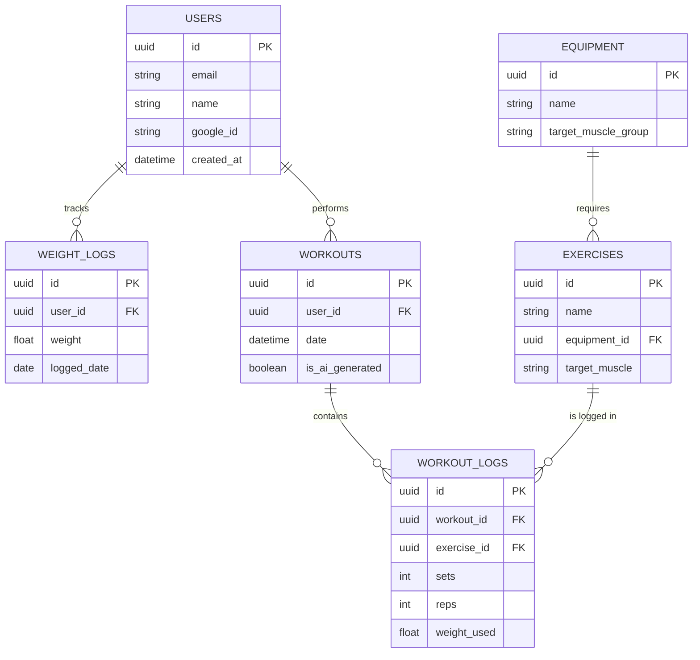

# 🗄️ Database Architecture

This document outlines the core relational database schema for the Fit AI Tracker. The database is designed for **PostgreSQL**, focusing on robust data integrity and efficient time-series querying for analytics.

## Entity-Relationship Diagram (ERD)

## Core Tables Description

* **USERS:** Core identity table. Authentication is handled via OAuth (Google), so no passwords are stored.
* **WEIGHT_LOGS:** Time-series data table for tracking user body weight over time to power analytics dashboards.
* **EQUIPMENT & EXERCISES:** The knowledge base. Equipment is strictly mapped to Exercises to allow the AI to filter workout generation based on real-world availability.
* **WORKOUTS & WORKOUT_LOGS:** Transactional tables. A workout acts as a session container, while logs store the granular data (sets, reps, weight) for progressive overload tracking.